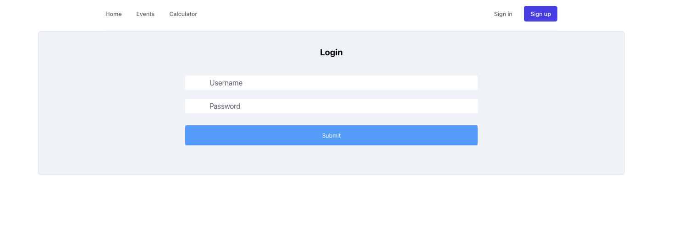
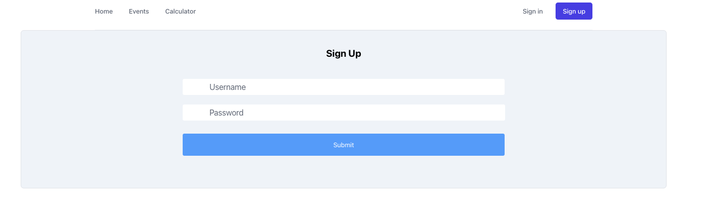
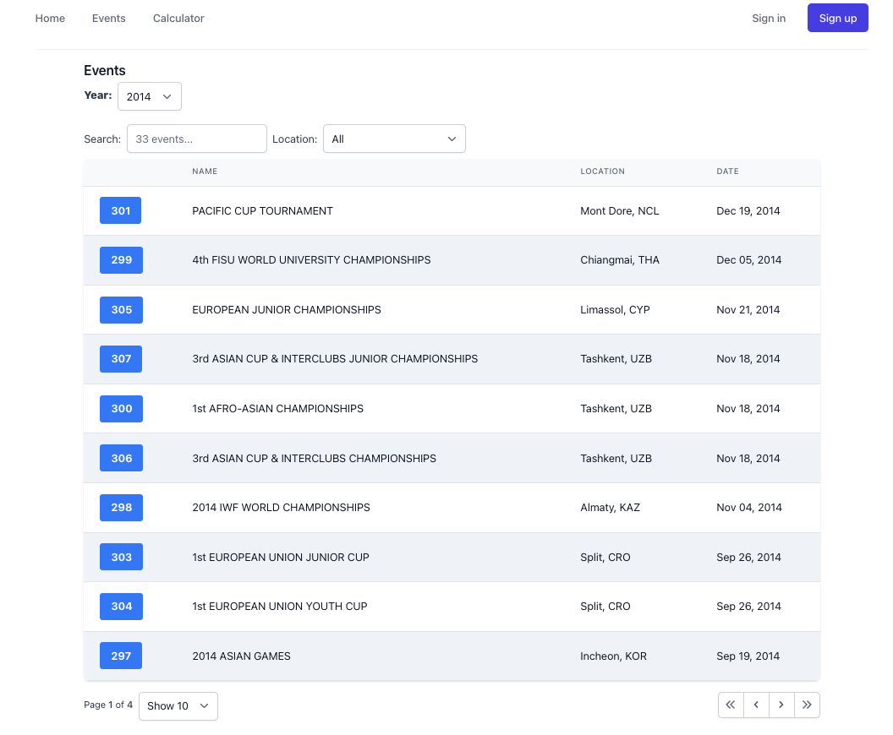
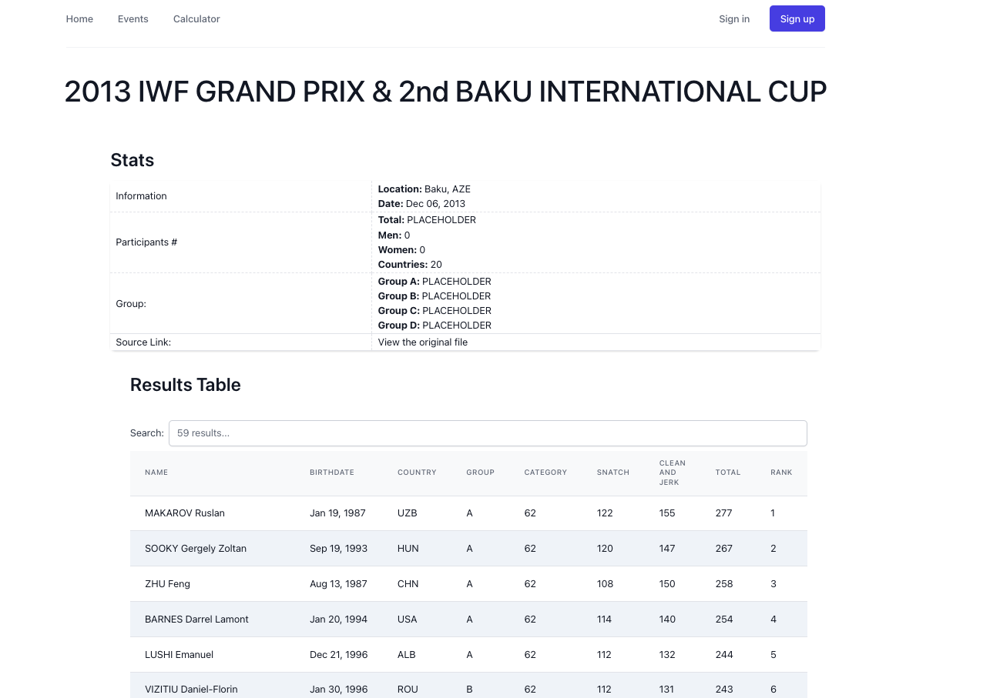
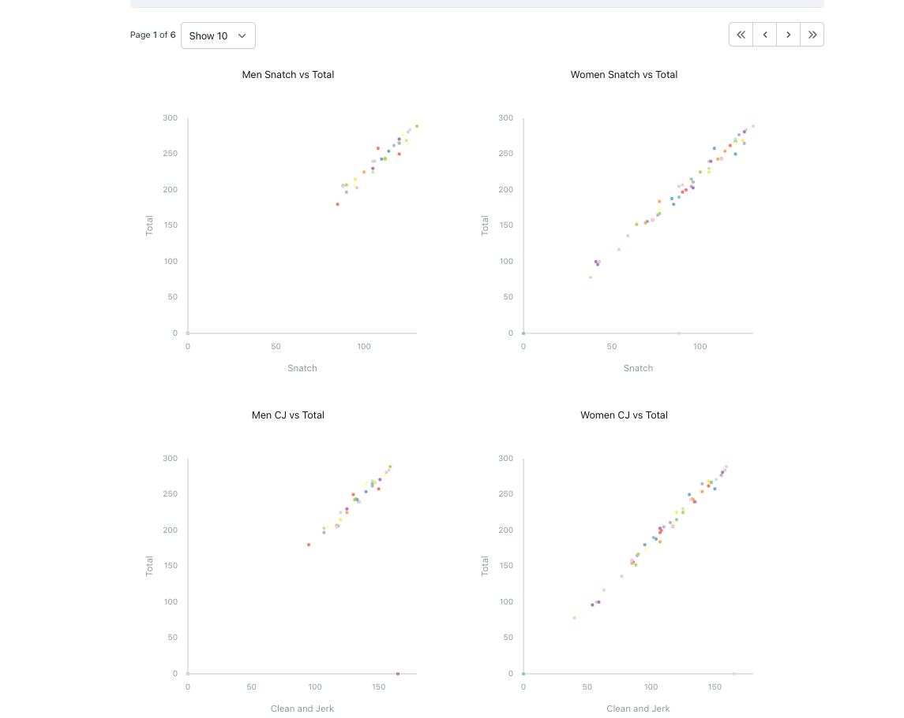

# Twler Frontend Beta

The frontend client for rendering IWF (Internationa Weightlifting Federation) results data.

Twler (Top Weightlifter) is an app that will **_directly_** render data that is scraped with iwf_ruby
(Not from a postgresql database!)

## Screenshots:

### Login



### Sign Up



### Events



### Results




## As a user, I can:

- signup and login
- see the event table accordance to year
  - select year from the dropdown menu to filter events
  - search the events using a global filter
  - filter and sort events by clicking on the headers
- click on the event to see the full result
- see the result statistics (work in progress)
- see the result table
  - search results using a global filter
  - filter and sort results by clicking the headers (work in progress)
- see the scatterplot charts
- use a working barbell calulator (kinda buggy with the change plates)

### Tools:

- react, tailwindcss, d3.js, p5.js

### Note:

This client is used alongside the backend:

```
https://github.com/jwc20/twler-backend
```

and the gem library:

```
https://github.com/jwc20/iwf_ruby
```
